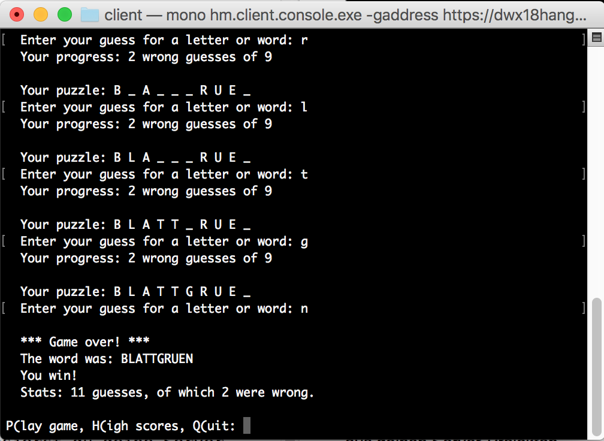

# Der Workshop-Baukasten
Im Workshop wollen wir eine serviceorientierte Anwendung bauen: das Spiel "Galgenmännchen" (engl. hangman).

Die Anwendung besteht am Ende aus drei Services: zwei laufen in der Cloud, einer läuft auf deinem Desktop lokal.

* Client: dein lokales Frontend über das du spielen und die Bestenliste einsehen kannst.
* Game Server: der Service in der Cloud, in dem deine Spiele verwaltet werden.
* Scoreboard Server: der Service in der Cloud, in dem die Spielergebnisse von Game Servern gesammelt werden.

Alle Services zu von Grund auf während des Workshops zu entwickeln, ist nicht möglich; dazu reicht die Zeit nicht. Deshalb liefern wir dir hier vorgefertigte Bausteine, die du nur noch "zusammekleben" musst.

Der "Kleber" ist ja auch das Thema des Workshops. Es geht um HTTP-Services, nicht darum, wie du Logik für ein Spiel oder eine Benutzerschnittstelle entwickelst.

Konkret sollst du "nur" die Server mit ihren Controllern implementieren. Als Bausteine liefern wir dir daher:

* Client: um zu spielen, musst du nichts weiter tun, als den fertigen Client zu starten. Du kannst ihn auf laufende Server in der Cloud richten und schonmal ein Gefühl für die Anwendung entwickeln. Das motiviert dich hoffentlich, durchzuhalten.
* Game Logik: die Logik der Spielabwicklung und Kommunikation mit dem Scoreboard Server ist bereits implementiert. Du musst sie nur noch aus deinem Game Server Controller aufrufen.
* Scoreboard Logik: die Logik für die Listenverwaltung ist bereits implementiert. Du musst sie nur noch aus deinem Scoreboard Server Controller aufrufen.
* Kontrake: Logik und Server bzw. Controller werden über einige Datenklassen und Interfaces miteinander verbunden.

Alle Bausteine wurden gegen den **.NET Framework 4.7.1** übersetzt.

## Vorgehen

### 0. Werkzeuge zurechtlegen
Als erstes stelle sicher, dass du alle Werkzeuge auf deinem Entwicklungsrechner bei der Hand hast. Du brauchst:

1. Eine C# IDE, z.B. Visual Studio oder Rider - weil du Code schreiben willst.
2. [Docker](https://www.docker.com/get-docker) - weil der Code am Ende in Containern laufen soll.
  1. Lege bitte auch ein Konto bei Docker an. Du brauchst es später für die Registrierung von Containern.
3. Einen REST-Client wie [Insomnia](https://insomnia.rest) oder [Postman](https://www.getpostman.com) - weil du Service-Implementationen testen können willst, ohne ein Frontend bemühen zu müssen.
4. Ein Konto bei [sloppy.io](https://sloppy.io/de/) - weil du deine Server in Docker Containern in der Cloud laufen lassen willst. Das sloppy.io-Konto bietet einen Testzeitraum; allerdings musst du ein Zahlungsmittel wie Paypal oder Kreditkarte hinterlegen. Aber keine Sorge, sloppy.io macht aus deinem Testkonto nicht automatisch ein Bezahlkonto; dein Zahlungsmittel wird nicht belastet, wenn du es nicht ausdrücklich wünschst.

### 1. Repository einrichten
Forke dieses Repository, so dass du eine eigene Version davon in deinem GitHub-Konto hast; dann klone es auf deinen Entwicklungsrechner. (Du kannst es auch nur klonen, allerdings ist dir dann kein Push erlaubt, so dass du keine Sicherung von Commits bei GitHub hast.)

### 2. Ausprobieren
Wenn du das Repository auf deinem Rechner hast, probiere gleich mal den Client aus.

1. Öffne ein Terminal-Fenster auf dem Verzeichnis `hangman/bausteine/client`.
2. Rufe dort den Client wie folgt auf: `hm.client.console.exe -gaddress https://dwx18hangmangservice.sloppy.zone`
  * Du musst beim ersten Aufruf einen Namen für dich festlegen, mit dem du in der Bestenliste angezeigt wirst. Bei anschließenden Programmstarts ist der Name dann schon bekannt. (Er wird in der Datei `player.json` gespeichert.)

Das sollte dann in etwa so aussehen:




### 3. Basteln
Jetzt bist du bereit, die Server selbst herzustellen. Wenn sie bei dir lokal laufen, kannst du den Client an sie binden.

Die Bausteine für die Server liegen als Assemblies hier im Repo vor. Die referenzierst du aus deinen Server-Projekten.

Während der Implementierung brauchst du ganz konkret noch ein NuGet-Paket:

* [ServiceHost](https://github.com/ralfw/servicehost) - weil du dir keinen Wolf implementieren willst, um Logik über HTTP ansprechbar zu machen.

Zwei weitere NuGet-Pakete sind in den Bausteinen darüber hinaus im Einsatz:

* [RestSharp](https://github.com/restsharp/RestSharp) - weil es damit ganz einfach ist, HTTP-Services aufzurufen.
* [appcfg](https://github.com/ralfw/appcfg) - weil du damit sehr leicht deine Services bei Start über die Kommandozeile, eine json-Datei oder Umgebungsvariablen konfigurieren kannst.

#### 3.1 Game Server
Am besten fängst du mit dem Game Server an. Wenn der nämlich läuft, kannst du in mit einem Scoreboard Server in der Cloud (`https://dwx18hangmansbservice.sloppy.zone`) verbinden und schon spielen. Das ist derselbe Scoreboard Server, der schon beim Ausprobieren vom Game Server in der Cloud benutzt wurde. Dein Spielername wäre dort schon bekannt.

##### Codestruktur
1. Lege eine Visual Studio Solution für *beide* Server an, z.B. `hangman.sln` an und darin zunächst ein **Console-Projekt** für den Game Server, z.B. `gameserver.csproj`.

2. Füge das NuGet-Paket [servicehost](https://www.nuget.org/packages/servicehost/) zum Projekt hinzu.
3. Referenziere die beiden Baustein-Assemblies aus diesem Repository:
  * `contracts\hm.contracts.dll`
  * `game_logic\hm.game.dll`
3. Lege eine Klasse für den Controller an, z.B. `Controller{}`. Die Funktionen dieser Klasse werden später per HTTP aufgerufen.
4. Lass deine Controller-Klasse so wie in Listing 1 aussehen.
5. Lass deine `Main()`-Funktion so wie in Listing 2 aussehen.
6. Starte dein Server-Projekt. Der ServiceHost darin bietet dann die Funktion `Version()` des Controllers zum Aufruf über HTTP an.
7. Teste den Service indem du im Browser die Adresse `http://localhost:8000` aufrufst. Dein Server sollte seine Versionsnummer liefern. (Die kannst du im Projekt unter `Properties/AssemblyInfo.cs` bei `[assembly: AssemblyVersion("...")]` einstellen.

Jetzt hast du sichergestellt, dass du überhaupt einen Service zum Laufen bringst. Super!

Als nächstes kannst du entweder den [Game Server komplettieren](doc/Game_Server_implementieren.md), indem du für die Handler-Funktionen in `hm.game.AdminRequestHandler{}` und `hm.game.GameRequestHandler{}` entsprechende Controller-Methoden anlegst.

Oder du bringst den Server, so wie er ist, [erstmal ins Internet](doc/Server_containerisieren.md).

Entscheide du, ob du lieber in der Breite oder in der Tiefe vorgehen willst.

###### Listing 1
```
using servicehost.contract;
using hm.contracts.data.dto;

[Service]
class Controller
{
    [EntryPoint(HttpMethods.Get, "/api/version")]
    public VersionDto Version() {
        Console.WriteLine("GET Version");

        return new VersionDto {
            VersionNumber = Assembly.GetExecutingAssembly().GetName().Version.ToString(),
            Timestamp = DateTime.Now
        };
    }
}
```

###### Listing 2
```
using servicehost;

internal class Program
{
    public static void Main(string[] args)
    {
        ServiceHost.Run(new Uri("http://localhost:8000"), new[]{typeof(Controller)});
    }
}
```

#### 3.2 Scoreboard Server
Lege ein weiteres **Console-Projekt** in der schon existierenden Solution für den Scoreboard Server an, z.B. `scoreboardserver.csproj`.

Wenn du den Game Server implementiert hast, ist der Scoreboard Server ein Klacks. Hier musst du für die Handler-Funktionen von `hm.scoreboard.ScoreboardRequestHandler{}` zugänglich machen.

Beginne aber am besten auch wieder mit einer `Version()`-Funktion auf dem Controller, um sicherzustellen, dass du alle Referenzen beisamen hast und den Server zum Laufen bekommst.

1. Füge das NuGet-Paket [servicehost](https://www.nuget.org/packages/servicehost/) zum Projekt hinzu.
2. Referenziere diese Bausteine
  * `contracts\hm.contracts.dll`
  * `scoreboard_logic\hm.scoreboard.dll`

Und dann weiter wie beim Game Server. Allerdings solltest du für den Scoreboard Server einen anderen Port wählen, z.B. 9000 (vgl. Listing 2).

Wenn der Scoreboard Server lokal läuft, überlege wieder, ob du zuerst den [Scoreboard Server komplettieren](doc/Scoreboard_Server_implementieren.md) willst oder ihn lieber erstmal [in die Cloud schiebst](doc/Server_containerisieren.md).


