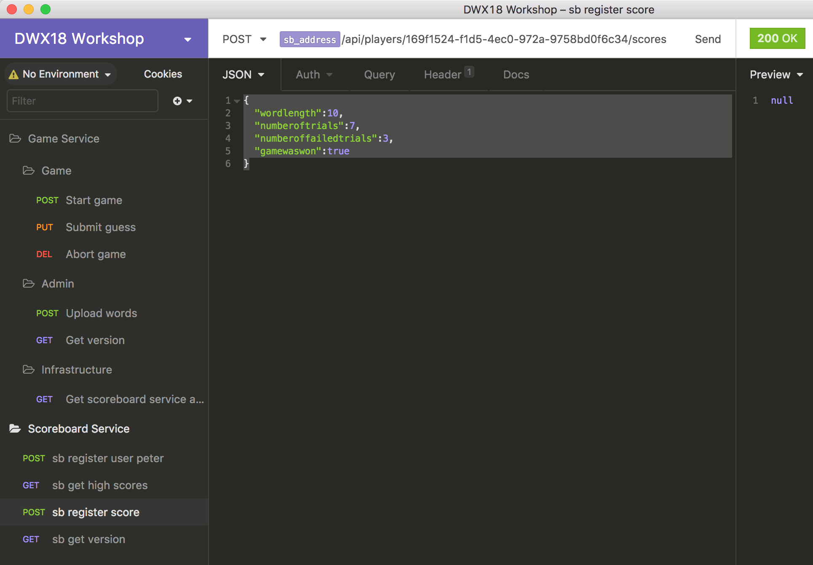

# Game Server implementieren
Der Game Server ist der "Spielmacher". Bei ihm werden Spiele gestartet, er führt Buch über den Spielfortschritt und entscheidet, wann ein Spiel gewonnen/verloren ist und meldet dann das Ergebnis an einen Scoreboard Server.

## Endpunkte
Die Entpunkte des Game Server fallen in verschiedene Kategorien:

* Infrastruktur (I)
* Administration (A)
* Spielen (S)

Sie können alle von einem Controller bedient oder auf mehrere verteilt werden.

### Scoreboard Server Adresse abfragen (I)
Benutzer sollen sich einen Game Server aussuchen, aber keinen Scoreboard Server. Jeder Game Server ist vielmehr schon mit einem Scoreboard Server verbunden. Da jedoch der Client einen direkten Kontakt auch zum Scoreboard Server braucht, fragt er einfach beim Game Server nach dessen Scoreboard Server.

**Request**

`GET {{g_address}}/api/infrastructure/scoreboardserviceaddress`

**Response**

* Statuscode: 200
* Content-Type: text/plain
* Beispiel: `http://localhost:9000/`

### Wortliste hochladen (A)
Ein Game Server wählt für neue Spiele das zu ratende Wort aus einer Liste. Die kann vom Client hochgeladen werden.

Das ist zwar eine Admin-Funktion und sollte nicht jedem Spieler erlaubt werden, doch der Einfachheit halber ist diese Funktionalität in den Client integriert.

Alternativ kannst du aber auch die Wortliste per `curl` hochladen:

`curl --data-binary @{wortlistendateiname} {{g_address}}/api/admin/words `

**Request**

`POST {{g_address}}/api/admin/words`

* Content-Type: text/plain
* Beispiel:

```
Klavier
Sitzkissen
Bildschirm
```

**Response**

* Statuscode: 200

### Spiel beginnen (S)

**Request**

`POST {{g_address}}/api/games?playerid={playerId}`

Die `playerId` muss vorher vom Scoreboard Server generiert worden sein, an den der Game Server Spielergebnisse meldet.

**Response**

* Statuscode: 200
* Content-Type: application/json
* Siehe: `hm.contracts.data.dto.game.GameStateDto`
* Beispiel:

```
{
	"gameId": "dd31949a-44d6-4fbe-8ee9-413281e52528",
	"puzzle": "K_A___",
	"numberOfTrials": 4,
	"numberOfFailedTrials": 2,
	"maxNumberOfFailedTrials": 9,
	"result": 0
}
```

### Raten (S)
In jeder Runde eines Spiels kann der Spieler einen Buchstaben oder sogar das ganze Wort raten. Die Vermutung wird an den Game Server geschickt, der sie auswertet und einen aktualisierten Spielstand zurückschickt.

**Request**

`PUT {{g_address}}/api/games/{gameId}/guesses`

* Content-Type: text/plain
* Beispiel: `k` oder `klavier`

**Response**

* Statuscode: 200
* Content-Type: application/json
* Siehe: `hm.contracts.data.dto.game.GameStateDto`
* Beispiel:

```
{
	"gameId": "dd31949a-44d6-4fbe-8ee9-413281e52528",
	"puzzle": "K_A___",
	"numberOfTrials": 4,
	"numberOfFailedTrials": 2,
	"maxNumberOfFailedTrials": 9,
	"result": 0
}
```

### Spiel abbrechen (S)
Ein Spiel endet automatisch, wenn es gewonnen oder verloren wurde. Der Spieler kann es allerdings auch vorher abbrechen. Dann wird kein Ergebnis an den Scoreboard Server gemeldet.

**Request**

`DELETE {{g_address}}/api/games/{gameId}`

**Response**

* Statuscode: 200

## Der Baustein
Der Baustein des Game Server bietet für zwei Funktionsbereiche einen eigenen Request Handler im Namespace `hm.game`. Ob du die aus einem Controller oder aus mehreren aufrufst, kannst du selbst entscheiden. Nach außen hin macht das keinen Unterschied; dort zählen nur die Endpunkte (Routes).

Für den dritten Funktionsbereich (Infrastruktur) wird kein Request Handler geboten, da dort keine Logik involviert ist. Die Adresse des Scoreboard Server kann direkt der Konfiguration entnommen werden (s.u.).

### Admin Request Handler
```
public class AdminRequestHandler
{
    public AdminRequestHandler(WordRepository wordrepo)
    
    public void UploadWords(string text)
}
```
### Game Request Handler
```
public class GameRequestHandler
{
    public GameRequestHandler(WordRepository wordrepo, GameRepository gamerepo, IScoreboardServiceProvider scoreboardServiceProvider)

    public GameStateDto StartGame(string playerId)
    public GameStateDto RegisterGuess(string gameId, string guess)
    public void AbortGame(string gameId)
}
```
### Repository für die Wortliste
Eine hochgeladene Wortliste wird über das Repository `hm.game.providers.WordRepository{}` gespeichert. Wie das genau funktioniert, ist für deine Implementations des Controller nicht wichtig. Aber für Testzwecke und die Bereitstellung mögen dich die Ctors interessieren:

```
public class WordRepository
{
    public WordRepository()
    public WordRepository(string path)    ...
}
```

### Game Repository
Spiele werden mit dem `hm.game.providers.GameRepository{}` verwaltet. Auch hier interessieren dich vielleicht die Ctors:

```
public class GameRepository {
    public GameRepository()
    public GameRepository(string path)
    ...
}
```

### Scoreboard Service Provider
Der Game Server steht mit dem Scoreboard Server über `hm.game.providers.ScoreboardServiceProvider{}` in Kontakt. Er ruft ihn auf, um ein Spielergebnis zu melden. Wie das genau geschieht, ist für dich nicht wichtig. Aber der Provider muss dafür mit der Adresse des Servers initialisiert werden:

```
public class ScoreboardServiceProvider
{
    public ScoreboardServiceProvider(Uri serverUri)
    ...
}
```

### Konfiguration
Der Server kann über die Kommandozeile oder Umgebungsvariablen konfiguriert werden. Wie das beim Aufruf konkret geschieht, kapselt `hm.game.providers.CLI{}`.

Ein `CLI{}`-Objekt sollte bei Start zum Beispiel in `Main()` sofort instanziiert werden.

```
public class CLI
{
    public CLI(string[] args)
            
    public Uri Address { get; }
    public Uri ScoreboardServiceAddress { get; }
}
```

**Usage**

* Default: `gameservice.exe`
  * Die Adresse wird auf `http://localhost:8000` gesetzt
  * Die Adresse des Scoreboard Server wird auf `http://localhost:9000` gesetzt

* Adressen explizit setzen: `gameservice.exe -address http://localhost:8001 -sbaddress http://localhost:9001`

**Umgebungsvariablen**

Alternativ können die Adressen über die Umgebungsvariablen `HM_GAME_SERVICE_ADDRESS` und `HM_SCOREBOARD_SERVICE_ADDRESS` konfiguriert werden.

## Der Server
Der Server wird mit der konfigurierten (oder einer festen) Adresse gestartet wie [in der Einführung beschrieben](../README.md). Wenn Konfiguration gewünscht ist, dann am besten via `CLI{}`.

Wenn der (oder die) Controller in derselben Assembly wie der Aufruf von `ServiceHost.Run()` lieg(t/en), muss dessen/deren Typ als Parameter explizit übergeben werden.

Außerdem ist zu entscheiden, wo/wann die Request Handler und die Repositories instanziiert werden. Geschieht das bei jedem Aufruf von Controllern erneut oder soll immer wieder dieselbe Instanz verwendet werden?

Ist Letzters gewünscht, kann die Request Handler Instanz leider nicht dem Controller per Injektion bekannt gemacht werden. Es ist also ein anderer Weg über statische Daten zu finden.

## Der Controller
Jeder Controller implementiert für jeden seiner Endpunkte eine Funktion, die den Aufruf an den ihm bekannten Request Handler weiterleitet. Beispiel:

```
[EntryPoint(HttpMethods.Put, "/api/games/{gameId}/guesses")]
public GameStateDto RegisterGuess(string gameId, [Payload] string guess) {
    Console.WriteLine($"PUT RegisterGuess({gameId}, '{guess}')");
    return _handler.RegisterGuess(gameId, guess);
}
```

Bei korrektem Einsatz der ServiceHost-Attribute ist kein (De)Serialisierungsaufwand zu treiben, auch wenn Daten im JSON-Format übertragen werden.

Aufgabe des Controllers ist es nur, den Request Handler via HTTP verfügbar zu machen. Der Controller sollte daher keine weitere Logik enthalten.

## Testen
Der Server kann auch ohne Client mit einem Tool wie `curl`, Insomnia oder Postman getestet werden.



Ein wenig aufpassen musst du dabei nur, wenn in der URL eines Aufrufs das Ergebnis eines logisch folgenden benutzt wird. Im Bild ist es z.B. die Spieler-ID, die zuerst durch Registrierung des Spielers generiert werden muss.