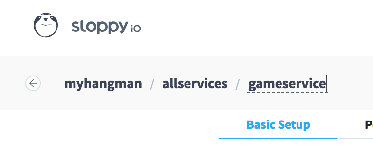

# Server containerisieren
Beide Server müssen in Container verpackt werden, um sie in der Cloud laufen zu lassen. Wir beschreiben das Vorgehen hier mit dem Game Server als Beispiel. Die manuelle Deployment Pipeline umfasst drei Schritte.

Wir erwarten zunächst allerdings nicht mehr Leistung vom Server als einen Endpunkt für die Versionsabfrage.

## 1. Server in einem Container hosten
1. Lege im Projektverzeichnis eine Datei mit Namen `Dockerfile` an. (Groß-/Kleinschreibung beachten!)
2. Die Datei bekommt den Inhalt von Listing 1.
3. Öffne im Projektverzeichnis ein Terminal-Fenster.
4. Baue ein Container-Image für den Server mit `docker build --tag gameservice .` Docker lädt beim ersten Mal das Mono-Image herunter. Das kann einen Moment dauern.
5. Starte nun das Image mit `docker run -p 8000:8000 gameservice`. Im Terminal-Fenster siehst du, wie der Server gestartet wird und wartet.
6. Öffne einen Browser und rufe den Service wie gehabt über `http://localhost:8000/api/version` auf.
7. Stoppe den Container über ein weiteres Terminal-Fenster
  1. Lass dir alle laufenden Container anzeigen mit `docker container ls`
  2. Stoppe den Container mit `docker stop <container id>`. Für die Container-ID reichen meist die ersten zwei Zeichen, z.B. "73" statt "737e777de15c".
  3. Du kannst den Container auch gleich "abräumen" mit `docker rm <container id>`.

Bitte beachte: Nur der Container als Instanz ist jetzt nicht mehr vorhanden. Der virtuelle Rechner ist sozusagen entsorgt. Das Image, von dem er instanziiert wurde, ist aber noch vorhanden. Vergewissere dich mit `docker images`. In der Liste wirst du ein Image mit Namen "gameservice" weiterhin finden. Puh, ein Glück. Das brauchst du jetzt nämlich...

###### Listing 1
```
FROM mono
COPY bin/Debug /app
EXPOSE 8000
ENTRYPOINT cd /app && mono gameserver.exe
```

Achtung! Die Annahme hier ist, dass der Server seine Dienste auf Port 8000 anbietet. Das ist für den Game Server laut Beispiel so, der Scoreboard Server läuft aber auf Port 9000. Oder welche Ports auch immer du wählst.

## 2. Image im Repository veröffentlichen
Um einen Container später bei sloppy.io laufen zu lassen, muss er zunächst in einem Image-Repository registriert werden. Wir benutzen das öffentliche Repository von Docker: [Docker Hub](https://hub.docker.com).

Wenn du dich bei Docker Hub anmeldet, siehst du dein Repository. Das läuft unter deiner Docker-ID. Die von Ralf Westphal ist z.B. `ralfw`.

Wenn du neu bei Docker bist, ist dein Repository natürlich leer. Aber das änderst du gleich.

1. Melde dich bei Docker im Terminal-Fenster an: `docker login`.
2. Gib deinem Image einen weiteren Namen. Setze dem bisherigen Namen deine Docker-ID voran: `docker tag gameservice <docker id>/gameservice`. (Du hättest das Image natürlich auch gleich mit diesem Namen bauen können, doch dann hätten wir in der Schrittfolge vorgegriffen.)
3. Liste nochmal deine Images mit `docker images`. Jetzt taucht dasselbe Image (siehe IMAGE-ID-Spalte) zweimal auf. Es hat zwei Tags/Namen.
4. Publiziere dein Image in dein Repository bei Docker Hub: `docker push <docker id>/gameservice`
5. Schaue in deinem Docker Hub Konto nach, ob das Image angekommen ist.

Jetzt kann die ganze Welt dein meisterhaft implementiertes Image "ziehen". Jeder kann davon Container instanziieren, jeder kann neue Images davon ableiten.

Für die Container in deinen geschäftlichen Projekten kannst du natürlich auch Images privat registrieren und andere Repositories benutzen. Für den Workshop reicht das default Angebot von Docker Hub aber aus.

## 3. Container bei sloppy.io betreiben
Mit einem Image in der Cloud kannst du nun einen Container beim Hoster deiner Wahl starten. Wir haben uns für sloppy.io entschieden, weil das ein deutscher Anbieter mit gutem Service und ordentlichem Preis ist.

Melde dich bei sloppy.io an und lege ein neues Projekt an:


Vergib gleich einen Namen für das Projekt:


Und gib dem Service einen Namen. Hier haben wir "allservices" gewählt, weil du unter dem selben sloppy.io-Service mehrere Container betreiben kannst. Du musst nicht mehrere Services in einem Projekt anlegen.


Jetzt öffne die Settings für die erste so genannte App in deinem Service.

Auf der Settings-Seite vergib gleich auch hier wieder einen Namen:



Und dann füllst du die restlichen relevanten Felder aus:


Der *Image Path* zeigt auf das Image in deinem Docker-Hub-Repository. Im Bild siehst du, wie Ralf das Image zu Demozwecken benannt hat. Ersetze "ralfw" durch deine Docker-ID.

Bei Networking weist du dem Container dann eine Adresse mit einer Subdomain von sloppy.zone zu. Der Port ist schon korrekt eingestellt wie im Dockerfile angegeben.

Abschließen klicke auf "Deploy Project" und lass sloppy.io sein Ding machen. Nach kurzer Zeit steht dein Container im Internet zur Verfügung.


Sobald du den Status "Running" siehst, klicke links auf "View" neben dem App-Namen (hier: "gameservice"). Es wird dann eine Seite mit der Adresse deines Service geöffnet.

Dort ist zunächst aber nur ein Fehler zu sehen, weil der Service nur auf konkreten Routes etwas anbietet. Hänge also `/api/version` an die URL an - und siehe da, du bekommst die Versionsinformation gezeigt.

Yay! Du hast deinen Dienst im Internet veröffentlich.

Bitte beachte: Der Container-Port ist 8000, aber sloppy.io mapt den auf den so genannten Host-Port 80! Deshalb musst du keinen Port im Browser angeben.

Zur Optimierung kannst du nun z.B. den reservierten Speicher verkleinern unter "Settings/Performance/Memory". 64 MB reichen aus. Wenn du auf "Deploy Changes" klickst, wird der Container neu gestartet.


Und unter "Manage" (die kleinen Schiebereglner neben dem Zahnrad) findest du eine Anzeige dessen, was im Container auf Standard-Output ausgegeben wird.


## Ausblick
So weit, so einfach. Oder? An den Schritten ändert sich nichts, auch wenn der Server mehr Leistung bekommt.

Beim Game Server wird in der vollen Ausbaustufe allerdings eine Abhängigkeit zum Scoreboard Server relevant. Dann musst du die sloppy.io-Adresse des Scoreboard Servers bei der Game-Server-App als Umgebungsvariable eintragen. Als Beispiel die Konfiguration des laufenden Demo-Servers:


